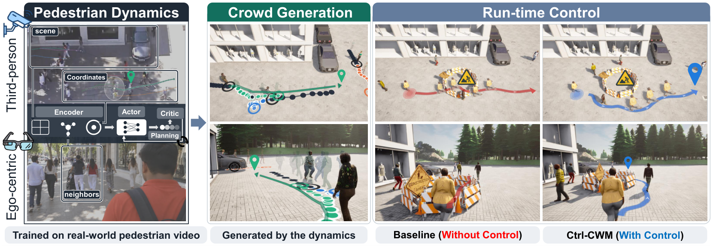
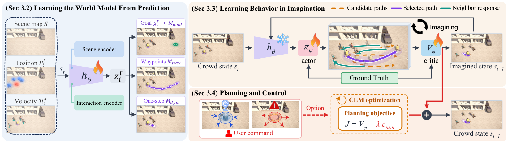

<h2 align="center">Controllable Crowd Generation<br>through World-Model Planning</h2>

<p align="center">
  <a href="https://jungyu0413.github.io/"><strong>JunGyu Lee</strong></a><sup>1</sup>
  &nbsp;·&nbsp;
  <a href="https://jsshin.com/"><strong>Jisu Shin</strong></a><sup>2</sup>
  &nbsp;·&nbsp;
  <a href="https://www.seunghyunshin.com/"><strong>Seunghyun Shin</strong></a><sup>2</sup>
  &nbsp;·&nbsp;
  <a href="https://scholar.google.com/citations?user=Ei00xroAAAAJ&hl=ko"><strong>Hae-Gon Jeon</strong></a><sup>1,*</sup>
  <br>
  <sup>1</sup>Yonsei University &nbsp;&nbsp; <sup>2</sup>GIST &nbsp;&nbsp; <sup>*</sup>Corresponding author
</p>

<p align="center">
  <a href="https://jungyu0413.github.io/Ctrl-CWM/"><strong><code>Project Page</code></strong></a>
  <a href="https://arxiv.org/abs/2610.09438"><strong><code>arXiv</code></strong></a>
  <a href="https://github.com/jungyu0413/Ctrl-CWM"><strong><code>Source Code</code></strong></a>
  <a href="#-citation"><strong><code>Citation</code></strong></a>
</p>

<div align="center">
  <br>
  <br><em>Human dynamics learned from real-world pedestrian video (left) drive continuous crowd generation (center) and run-time crowd control (right). User-defined objectives can be introduced at run time without retraining the model.</em>
</div>

<br>

## 📝 Abstract

Crowd simulation plays a central role in robot navigation, autonomous driving, and urban planning. For these
applications, realistic simulation requires crowds to adapt their behavior to environmental changes and user
objectives. However, existing methods that rely on predefined control settings have limited flexibility in
accommodating new user-specified objectives. To address this limitation, we propose **Ctrl-CWM**, a multi-agent
Controllable Crowd World Model that integrates crowd generation and run-time control. Our key
idea is to adapt the world-model principle of planning using imagined futures to crowd simulation. To this end,
Ctrl-CWM consists of an encoder that learns a representation of human motion dynamics, an actor that proposes
pedestrian displacements, a critic that evaluates imagined crowd trajectories, and a planner that selects actions.
We first learn human motion dynamics through trajectory prediction on real-world pedestrian videos and then freeze
the encoder to preserve them. Using this representation, the actor generates imagined crowd trajectories through
repeated state updates, and the planner combines the critic's scores with user costs to select actions. Repeated
planning advances the simulated crowd, while additional user costs introduce new control objectives without
retraining. We extensively evaluate crowd generation under varied agent arrival conditions and run-time control
across avoidance and attraction scenarios. Ctrl-CWM outperforms the state-of-the-art method on most crowd realism
and collision metrics, and adapts crowd behaviors to user-specified objectives introduced during simulation.

<br>

## 🧭 Method

<div align="center">
  
  <br><em>Trajectory prediction trains the state encoder h<sub>θ</sub> on real pedestrian data, which is then frozen. The actor π<sub>ψ</sub> and critic V<sub>φ</sub> learn over imagined rollouts on this representation, and CEM adds a user cost to the critic score for run-time control.</em>
</div>

<br>

| Paper | Code |
|:--|:--|
| Crowd state, transition (Sec. 3.1, Eq. 2) | [`ctrl_cwm/simulation/simulator.py`](ctrl_cwm/simulation/simulator.py) `CtrlCWMSimulator` |
| Feature extractor h<sub>θ</sub>: scene U-Net + interaction encoder with FiLM (Sec. 3.2) | [`ctrl_cwm/models/encoders.py`](ctrl_cwm/models/encoders.py) |
| Goal, waypoint and dynamics heads | [`ctrl_cwm/models/heads.py`](ctrl_cwm/models/heads.py) |
| Prediction objective (Eq. 3) | [`ctrl_cwm/training/stage1.py`](ctrl_cwm/training/stage1.py) `prediction_loss` |
| Actor π<sub>ψ</sub> | [`ctrl_cwm/models/actor.py`](ctrl_cwm/models/actor.py) |
| Imitation, kinematic, adversarial objectives (Eq. 4–6) | [`ctrl_cwm/training/losses.py`](ctrl_cwm/training/losses.py), [`stage2.py`](ctrl_cwm/training/stage2.py) `BehaviorLearner.actor_step` |
| Critic V<sub>φ</sub>, candidate costs, listwise objective (Eq. 7–9) | [`ctrl_cwm/models/critic.py`](ctrl_cwm/models/critic.py), `BehaviorLearner.candidate_costs`, `critic_step` |
| CEM planning with user costs (Sec. 3.4, Eq. 10–12, Alg. 1) | [`ctrl_cwm/planning/cem.py`](ctrl_cwm/planning/cem.py) `CEMPlanner`, `UserCost` |
| Local goal updates every L steps (App. A.3) | `CtrlCWMSimulator._goals` |
| Control compliance (Eq. 13) | [`tools/score_control.py`](tools/score_control.py) |

<br>

## 📊 Results

**Crowd generation.** Averages over five ETH–UCY folds, SDD, and GCS, with identical replayed arrivals across
methods. **Bold**: best, <u>underline</u>: second best. Lower is better except Div.

| Method | Dens. | Freq. | Cov. | Pop. | Kinem. | DTW | Div. | Col. (%) |
|:--|:-:|:-:|:-:|:-:|:-:|:-:|:-:|:-:|
| *Random-surface arrivals* | | | | | | | | |
| ORCA | 1.044 | **0.099** | **0.099** | 2.659 | 1.015 | 2.857 | 0.196 | **0.009** |
| CrowdES | <u>0.746</u> | 0.128 | 0.128 | <u>1.871</u> | <u>0.605</u> | <u>2.204</u> | **0.294** | 3.448 |
| **Ctrl-CWM (ours)** | **0.477** | <u>0.111</u> | <u>0.111</u> | **1.244** | **0.545** | **1.713** | <u>0.285</u> | <u>1.739</u> |
| *Diffusion arrivals* | | | | | | | | |
| ORCA | 1.029 | 0.106 | 0.106 | 2.595 | 1.198 | 3.228 | 0.180 | **0.065** |
| CrowdES | <u>0.147</u> | <u>0.052</u> | <u>0.051</u> | **0.315** | **0.525** | <u>2.126</u> | <u>0.297</u> | 1.930 |
| **Ctrl-CWM (ours)** | **0.110** | **0.046** | **0.046** | <u>0.372</u> | <u>0.660</u> | **1.738** | **0.310** | <u>1.572</u> |

**Run-time avoidance control.** Compliance C<sub>avoid</sub> = 1 − occ<sub>cmd</sub>/occ<sub>free</sub> (higher is better).
Ctrl-CWM receives the objective online; the baselines get the obstacle from initialization.

| Method | ETH | HOTEL | UNIV | ZARA1 | ZARA2 | SDD | GCS | AVG |
|:--|:-:|:-:|:-:|:-:|:-:|:-:|:-:|:-:|
| *Disc zone* | | | | | | | | |
| ORCA + obstacle | **1.000** | −1.154 | 0.530 | 0.428 | **1.000** | <u>0.344</u> | **0.999** | 0.450 |
| CrowdES + map | 0.599 | <u>0.546</u> | <u>0.727</u> | <u>0.469</u> | 0.598 | 0.317 | 0.436 | <u>0.527</u> |
| **Ctrl-CWM (ours)** | <u>0.837</u> | **0.988** | **0.831** | **0.752** | <u>0.714</u> | **0.877** | <u>0.827</u> | **0.832** |
| *Rectangle zone* | | | | | | | | |
| ORCA + obstacle | **1.000** | −1.484 | 0.526 | −0.049 | **1.000** | −1.827 | <u>0.595</u> | −0.034 |
| CrowdES + map | 0.883 | <u>0.808</u> | **0.779** | <u>0.790</u> | 0.824 | <u>0.114</u> | 0.301 | <u>0.643</u> |
| **Ctrl-CWM (ours)** | <u>0.896</u> | **0.881** | <u>0.683</u> | **0.988** | <u>0.912</u> | **0.934** | **0.932** | **0.889** |
| *Multiple zones* | | | | | | | | |
| ORCA + obstacle | <u>0.973</u> | **0.999** | <u>0.601</u> | −1.952 | −0.304 | −0.473 | <u>0.768</u> | 0.087 |
| CrowdES + map | 0.479 | 0.542 | 0.549 | <u>0.781</u> | <u>0.751</u> | <u>0.525</u> | 0.424 | <u>0.579</u> |
| **Ctrl-CWM (ours)** | **0.992** | <u>0.997</u> | **0.993** | **0.983** | **0.971** | **0.908** | **0.808** | **0.950** |

<br>

## 🛠️ Setup

**Environment.** Python ≥ 3.9 and PyTorch ≥ 2.0.

```bash
git clone https://github.com/jungyu0413/Ctrl-CWM.git && cd Ctrl-CWM
pip install -r requirements.txt
```

**CrowdES.** Generation, scoring and stage-2 training use the
[CrowdES](https://github.com/InhwanBae/Crowd-Behavior-Generation) simulator and evaluation protocol.
Clone it, download its preprocessed datasets and checkpoints, and point `CROWDES_ROOT` at it:

```bash
git clone https://github.com/InhwanBae/Crowd-Behavior-Generation
export CROWDES_ROOT=$PWD/Crowd-Behavior-Generation
```

**Dataset.** ETH-UCY trajectories (standard leave-one-out split) go in `data/datasets/<fold>/`. The ETH-UCY scene
maps (walkable area, segmentation, homography) are included in `data/maps/eth-ucy/`. SDD and GCS are built with

```bash
python tools/prepare_data.py sdd
python tools/prepare_data.py gcs
python tools/build_gcs_fixed.py      # GCS generation uses the dataset name gcs_fixed
```

<br>

## 🔥 Training

**Stage 1. World model from prediction:**

```bash
python train_prediction.py --config configs/prediction.yaml --dataset zara1 --width 0.25
```

**Stage 2. Actor and critic on the frozen world model:**

```bash
python train_generation.py --config configs/behavior.yaml --dataset zara1 \
    --world-model checkpoints/zara1_prediction.pth
```

Hyperparameters are in [`configs/`](configs).

<br>

## 🚀 Generation and Control

```bash
# crowd generation
python generate.py --config configs/generation.yaml --dataset zara1 --checkpoint checkpoints/zara1_ctrlcwm.pth

# run-time avoidance control and its compliance
python generate.py --config configs/avoid.yaml --dataset zara1 --checkpoint checkpoints/zara1_ctrlcwm.pth \
    --avoid 83,123,25 --tag avoid
python tools/score_control.py --gen-dir output/generated/zara1 --scene crowds_zara01 \
    --cmd-tag avoid --free-tag ctrlcwm --region 83,123,25 --to-grid 576,720,192
```

`--planner none` gives actor-only generation, `--planner user` ranks candidates by the user cost only,
`--attract cx,cy` replaces avoidance with attraction, and `--emitter surface` uses random-surface arrivals.

**Prediction.**

```bash
python eval_prediction.py --dataset zara1 --checkpoint checkpoints/zara1_prediction.pth --rot 0 15 -15 30 -30 --flip
python eval_prediction_sdd.py --checkpoint checkpoints/sdd_prediction.pth --ref sdd_test.pkl --rot 0 15 -15 30 -30 --flip
```

**Pretrained weights** will be released on the [release page](https://github.com/jungyu0413/Ctrl-CWM/releases).

<br>

## 🗂️ Code Structure

<details>
<summary>Click to expand</summary>

```
Ctrl-CWM/
├── ctrl_cwm/
│   ├── data/          # maps, grids, stage-1 prediction windows, stage-2 simulation windows
│   ├── models/        # feature extractor, heads, actor, critic, world model
│   ├── training/      # stage 1 (prediction), stage 2 (behavior), losses
│   ├── planning/      # CEM planner and user costs
│   ├── simulation/    # Ctrl-CWM simulator, CrowdES interface
│   └── evaluation/    # prediction metrics
├── train_prediction.py   train_generation.py   generate.py
├── eval_prediction.py    eval_prediction_sdd.py
├── configs/           # prediction, behavior, generation, avoid
├── tools/             # data preparation, CrowdES baseline, rollout and control scoring
├── data/              # ETH-UCY scene maps
└── docs/              # project page
```

</details>

<br>

## 📖 Citation

If you find this code useful, please cite our paper:

```bibtex
@article{lee2026ctrlcwm,
  title   = {Controllable Crowd Generation through World-Model Planning},
  author  = {Lee, JunGyu and Shin, Jisu and Shin, Seunghyun and Jeon, Hae-Gon},
  journal = {arXiv preprint arXiv:2610.09438},
  year    = {2026}
}
```

<br>

## 📄 License

This code is released under the [MIT](LICENSE) license, matching
[CrowdES](https://github.com/InhwanBae/Crowd-Behavior-Generation), on which our generation and evaluation build.

## 🙏 Acknowledgement

Our generation and evaluation build on [CrowdES](https://github.com/InhwanBae/Crowd-Behavior-Generation). Scenes on
the project page use Google Photorealistic 3D Tiles, Project PLATEAU (MLIT Japan), Korea Heritage Service models,
OpenStreetMap, and CC0 props by Quaternius, Kenney and iPoly3D. We thank the authors for releasing their code and data.
